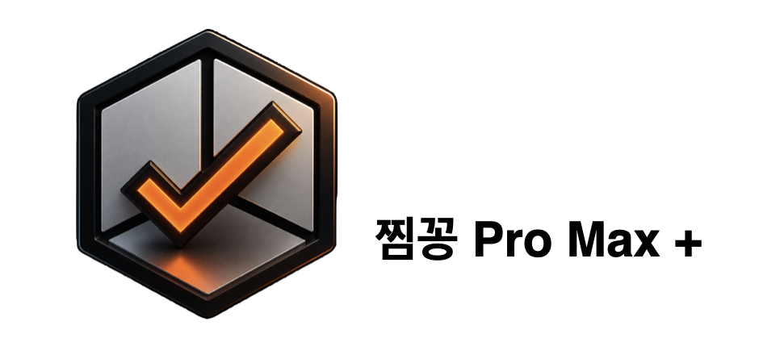
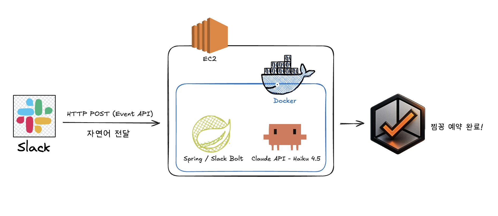

### 제 1회 테코톤: 우리 주변의 불편함 해결하기

#### 팀명 : 러로 너모 걱정마요 밍구믿구 오늘은 오제제보다 더 나을거에요



# 찜꽁 Pro Max+ for Slack

> "/찜꽁 오늘 4시 보이저 예약해줘" — Slack에서 자연어 한 문장으로 회의실 예약 완료

**소개**

우아한테크코스 구성원들은 하루에도 수차례 슬랙으로 소통하며 회의를 잡습니다.
그런데 막상 회의실을 예약하려면 슬랙을 벗어나 찜꽁 사이트에 접속하고, 로그인하고, 날짜·시간·공간을 일일이 선택하는 과정을 매번 반복해야 했습니다.
찜꽁 Pro Max+ 는 그 흐름을 없앱니다.
회의 약속이 오가는 바로 그 슬랙 채팅창에서, 평소 대화하듯 한 문장을 입력하는 것만으로 예약이 완료됩니다.

> 도구를 위해 대화를 멈추는 것이 아니라, 대화 안에서 도구가 움직이는 것.

**사용 흐름**
```
유저 입력  →  "@봇 4시에 보이저 예약해줘"
↓
Slack Bot 메시지 수신
↓
Spring Boot 미들웨어 — Claude API 호출
자연어 파싱 → { date: "오늘", time: "16:00", room: "보이저" }
↓
찜꽁 REST API 호출
```


**기능**

| 기능 | 예시 |
|---|---|
| 자연어 회의실 예약 | "오늘 4시에 보이저 예약해줘" → 자동 예약 (비밀번호 미입력 시 1234 기본 설정) |
| 시간 및 상대 날짜 자동 보정 | "내일 2시" → 찜꽁 운영시간 기준 14:00으로 인식 |
| 유연한 예약 시간 설정 | "오늘 2시에 30분 예약해줘" → 기본 1시간 외 맞춤 시간 지원 |
| 층별 빈 회의실 조회 | "지금 12층에 빈 회의실 있어?" → 현재 예약 가능한 공간 안내 (추후 예정) |
| 조건부 가용 회의실 자동 배정 | "페어룸 빼고 아무데나 예약해줘" → 조건에 맞는 빈 방 탐색 후 예약 (추후 예정) |
| 회의실 오타 교정 | "허브 예약해줘" → "허블"로 자동 매핑 (추후 예정) |


**기술 스택**

* Backend — Spring Boot (단일 애플리케이션)
* AI — Claude API (Haiku) — 자연어 파싱 및 intent 추출
* Messaging — Slack Bolt / Event API
* Reservation — 찜꽁 REST API 직접 호출


### **아키텍처**


**차별점**

기존 슬랙봇들이 버튼·드롭다운 UI로 예약을 안내하는 것과 달리,
**찜꽁 Pro Max +** 는 자연어만으로 예약의 시작과 끝을 슬랙 안에서 완결합니다.

* 별도 앱 설치 없음
* 웹사이트 이동 없음
* 평소 대화하듯 입력한 한 문장 → 예약 완료
* Claude Haiku 기반 경량 AI로 빠른 응답 + 낮은 운영 비용

**대상 사용자**

* woowacourse 워크스페이스에 초대된 우아한테크코스 크루 및 코치
* 찜꽁을 통해 회의실을 예약하는 모든 구성원
